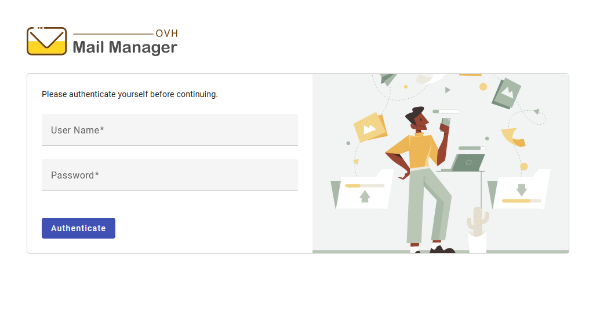
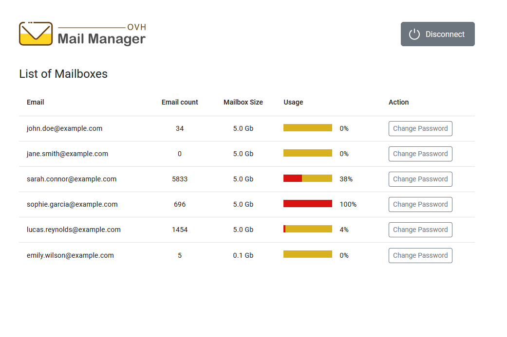
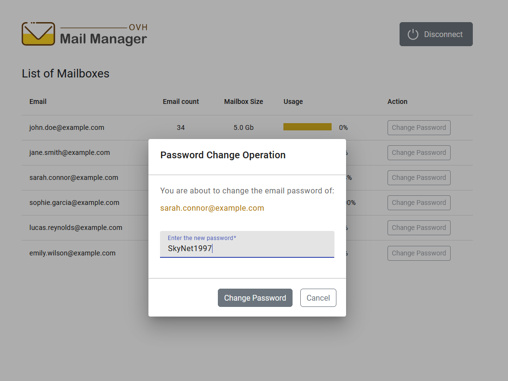
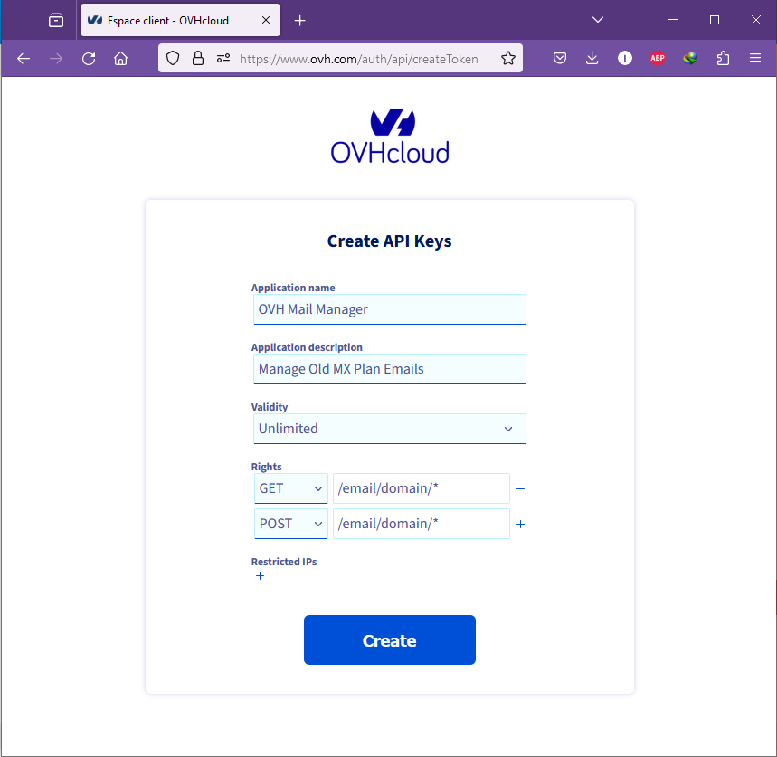

# OVH Mail Manager

OVH Mail Manager is an application designed to simplify the process of changing RoundCube email passwords for users with
old MX Plan hosting on OVH. This application provides a user-friendly interface for updating
email passwords directly without the need to access the main OVH account.

Owners of legacy infrastructure are unable to directly modify their email passwords within RoundCube. Instead, they must
perform this operation through their main OVH account. For those managing multiple customer domain sub-accounts,
sharing the main OVH account poses security risks, particularly concerning mailbox owner privacy. Moreover, clients
often prioritize privacy, insisting on sole access to their mailbox passwords. In response to these challenges, OVH Mail
Manager emerges as a solution, offering a secure and convenient method for password management.

## Features

- **User-friendly Interface**: Intuitive interface designed to streamline the password change process.
- **Secure**: Utilizes secure communication protocols to ensure the safety of user data.
- **Angular Frontend**: Frontend built with Angular framework for dynamic and responsive user experience.
- **PHP Backend**: Backend implemented in PHP for handling password change requests securely.
- **Easy Integration**: Simple setup process for integrating with existing OVH MX Plan hosting accounts.

## How it works

OVH provides its customers with access to an impressive array of REST APIs, enabling programmable interaction with
diverse OVH services and resources. The Email Password modification is facilitated via the OVH Email API. To utilize
this API, configuration of the "OVH Mail Manager" application is required, including the provision of API Keys and the
domain name associated with the account.







## How to create OVH API Keys

1. API Keys can be generated from [https://eu.api.ovh.com/createToken/](https://eu.api.ovh.com/createToken/)
2. Sign in to OVHcloud with your credentials.
3. Next, complete the provided form like the example below.

   

   Take a particular attention on the rights to grant:
    - `GET : /email/domain/*`
    - `POST : /email/domain/*`

4. Choose an "unlimited" validity.
5. Click on the "Create" button.
6. You will then receive:
    - Application Key
    - Application Secret
    - Consumer Key

These will be used for application configuration. *(See below)*

If you want complete information about OVH APIs,
please [Click Here](https://help.ovhcloud.com/csm/en-gb-api-getting-started-ovhcloud-api?id=kb_article_view&sysparm_article=KB0042784)

## User Installation Guide

The installation procedure is straightforward and simple:

1. Set up and configure a subdomain name for your MX Plan hosting.
   *(Ex: `mail-manager.example.com`)*
2. Download the `ovh-mail-manager.zip` file from either the /build GitHub folder or from the Releases section.
3. Unzip the file on your local computer.
4. Proceed to configure the application by editing the `./api/config.php` file.

You'll encounter the following PHP constants that require editing. Populate them with their respective values.

```
// Put your OVH API Keys here
define( 'OVH_APPLICATION_KEY', 'b96d12a9ea4fd9c8' );
define( 'OVH_APPLICATION_SECRET', '38afe19b8799c83ed7390cc2631f346' );
define( 'OVH_CONSUMER_KEY', '1045bb81c38f1587a67b16f55abcd1' );
define( 'OVH_API_ENDPOINT', 'ovh-eu' );

// URL of the backend
// Do not change it if you use the installation from the downloaded realease 
define( 'APP_API_ENDPOINT', '/api' );

// Just put what you want
// It is used to encrypt your authorization token
// for frontend/backend communications
define( 'AUTH_SECRET_KEY', 'My Secret Key' );

// Used to authenticate you on login form
define( 'LOGIN_USERNAME', 'master' );
define( 'LOGIN_PASSWORD', 'password' );

// The domain name associated to the MX Plan Hosting
define( 'DOMAIN_NAME', 'example.com' );

// A list of email accounts you want to be excluded from listing
define( 'EXCLUDE_ACCOUNTS', array('alice.winters', 'max.carter') );

```

5. Finally, upload the files to the root directory associated with the created subdomain using FTP.

## Developer Setup Guide

This section provides step-by-step instructions for setting up your development
environment to start working on the "OVH Mail Manager" application. Let's dive in!

1. Clone the repository:

   ```
   git clone https://github.com/imandresi/ovh-mail-manager.git
   ```

2. Navigate to the `frontend` folder and install dependencies:

   ```
   cd dev/frontend
   npm install
   ```

3. Navigate to the `backend` folder and install dependencies:

   ```
   cd dev/backend
   composer install
   ```

4. Configure the application:
    - For the frontend, navigate to the `src/assets/config.json` file and make the necessary modifications. Specify the
      main URL to the backend endpoint. For further guidance on the frontend
      development, [Click Here](./dev/frontend/README.md).

    - For the backend, access the `config.php` file and adjust the settings accordingly. Detailed instructions can be
      found in the previous "Installation" section.
      For additional insights into the backend development, [Click Here](./dev/backend/README.md).

## License

This project is licensed under the MIT License - see the [LICENSE](LICENSE) file for details.

## Image Credit

The image used in the login page of this application was downloaded from
[www.freepik.com](https://www.freepik.com/free-vector/landing-page-transfer-files-concept_5754876.htm) and is
used under the Freepik License.
